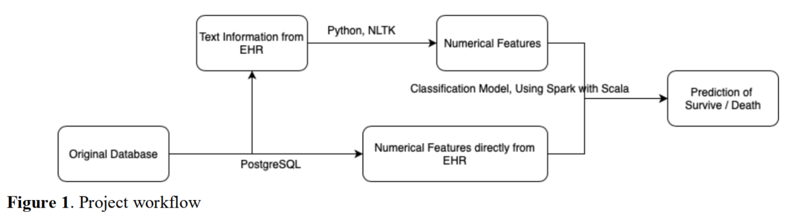
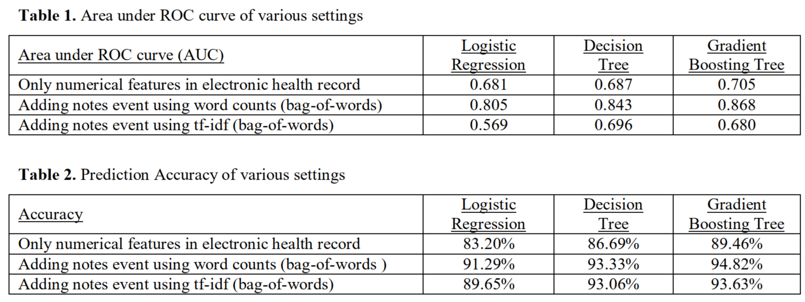
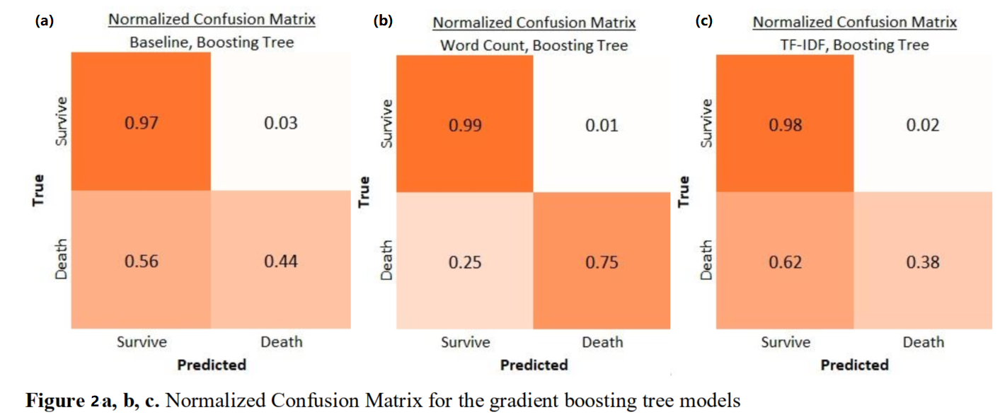
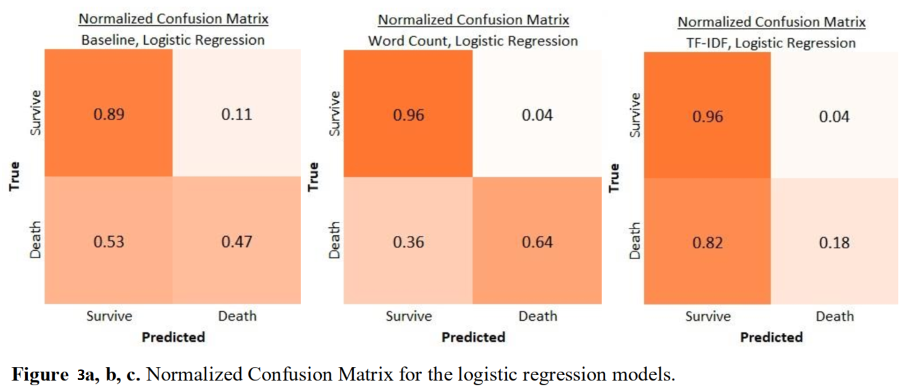
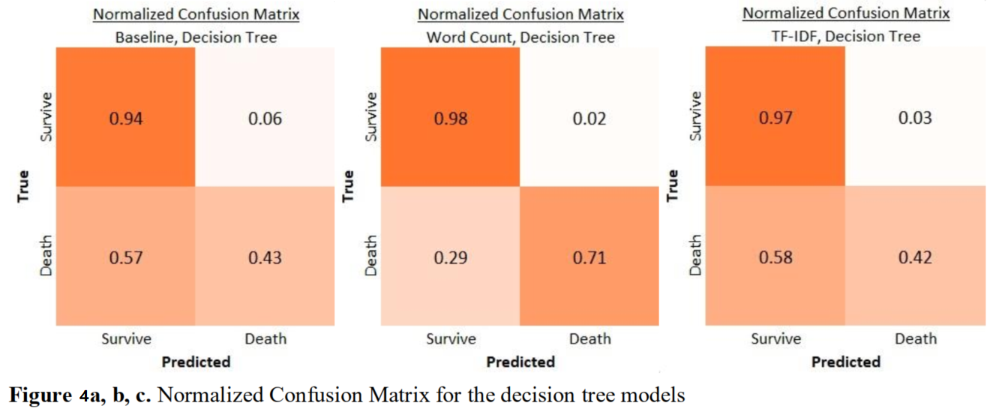

# Mortality Risk Prediction with Natural Language Processing

## Project Overview

This project is to improve the mortality risk prediction of diabetic ICU patients with natural language processing. Based on the study of building predictive models with values of chart events (medications, lab tests and diagnosis), our work focuses on improving the modeling by extracting information from medical notes. Using the MIMIC-III database, we applied natural language processing (NLP) techniques to convert text notes to numerical features. By combining these text-related features with non-text-related features and employing machine learning algorithms, we improved the AUC from 0.705 to 0.868 and the prediction accuracy from 89.46% to 94.82% under the gradient boosting tree model. This study demonstrated the effectiveness of applying NLP into mortality risk prediction and its potential to be employed to guide special care for ICU diabetic patients.

## Team 

- Shuyan Huang
- Siu Hang Chan
- Chung Yau Jefferson Choi

## Deliverable Structure

- baseline folder: contains out baseline model which is built on numerical data (no text related features)
- wordcount folder: contains our wordcount model
- tfidf folder: contains our model TFIDF model
- bestmodel folder: contains our best model which is the trained gradient boosting tree with word count

## Background

Diabetes patients constitute 9.4% of the United States population by the year of 20151. Complications, such as cardiovascular, cerebrovascular and neuropathic diseases, are tightly associated to mortality risk of patients. In the meantime, patients in Intensive Care Units (ICU) are at high risk of getting hyperglycemia because of complex immune responses and counter-regulatory responses, which exacerbates the situation of diabetes patients in critical care. Therefore, glucose control in ICU has attracted much attention in the past 20 years2-4. By investigating the mortality risk for diabetic patients in ICU, treatments of these patients could be potentially better regulated.  

Algorithms derived from diagnosis codes and lab tests have been well established for both general population and diabetic patients. Utilizing ICD-9-CM and ICD-10 codes, Quan H. and colleagues applied the Charlson Comorbidity Index (CCI) and the Elixhauser Comorbidity Index to predict mortality risk for general population5. Young BA and colleagues developed the Diabetes Complications Severity Index (DCSI) from primary care automated baseline data to predict risk of mortality, hospitalization, and healthcare utilization for patients with diabetes6. Based on these predecessors' work, a more recent research on predicting mortality in diabetic ICU patients, using the abovementioned indexes, has been conducted by Rajsavi S. Anand's group7. By now, there has not been much research on Natural Language Processing (NLP) of medical notes to improve mortality risk prediction for diabetic patients in ICU. However, those notes represent doctors' knowledge and insight which may not be revealed by charted values. Therefore, we believe investigating into them will potentially make an improvement to mortality risk prediction.  

Improved mortality prediction for diabetic patients in ICU is a big challenge. We would like to assess whether performing NLP on diabetic patients’ discharge summaries could increase the accuracy of mortality prediction for diabetic patients in ICU and to assess its performance compared with our baseline scoring.  

## Approaches

#### *Workflow*

Our baseline model took only numeric features, including medications, lab tests and diagnosis from the database. For our improved models, we combined the above mentioned numeric features with the numeric features derived from medical text notes. Our workflow was shown as below in Figure 1.   

#### *Data Preprocessing*

The raw data was extracted from Medical Information Mart for Intensive Care III (MIMIC-III) database8, 9 and was imported into our local PostgreSQL database server. All tables regarding admissions, medications, lab tests, diagnoses, ICU stays, as well as note events were employed. The selected patients were those with ICD9-CODE of 250.0 - 259.0 (indicating diabetes). We then exported seven csv files, including admissions, medications, lab tests, diagnoses, ICU stays, note events and transformed the text data into numbers by bag of words (with or without tf-idf) technique using Python with Numpy, Pandas and NLTK packages.  

#### *Feature Construction*

The features construction was conducted in Spark using Scala. The index dates were determined as either 30 days prior to the death date for deceased patients or the last event date for alive patients. The observation window started 2000 days (including 2000th day) prior to the index date and ended on the index date. The size of prediction window was 30 days. To create features suitable for machine learning, we
aggregated the events for each patient as follows: count diagnostic, medication events and words, average lab test values and tf-idf. The constructed features vectors were sparse.  

#### *Model and Evaluation*

The constructed features were randomly split into training and validation subsets at a ratio of 6:4. The training subset was used to train the classification models using Spark MLlib. There were three different classification mode: logistic regression (with L2-regularization), decision tree, and gradient boosting tree. In order to investigate the effect/benefit of including the text features, we consider the follow cases for each of the three classification models: 

- taking numeric features only 
- taking numeric features combined with word counts  
- taking numeric features combined with tf-idf of words  

The area under ROC curve (AUC) were considered as the major comparison metric, and it was supplemented by the overall accuracy, and the accuracy for each case of ground truth
(from confusion matrix). 

## Results 

#### *Exploratory Data Analysis (EDA)* 

We had 11505 out of 46520 distinct patients with diabetes, which means our sample takes approximately 25% of all patients in record. Also, there are 629908 notes for these 11445 distinct diabetic patients, which corresponds to 55 notes per patient. The maximum number of notes for these patients is 1420, while the minimum number is 0 meaning 60 diabetic patients do not have any notes. Among 11445 patients, 5296 patients were deceased (46.3%).  

#### *Model Performance*

Among the three classification models, the gradient boosting tree performed the best, as shown in Table 1, 2. Comparing the baseline model with only numerical EHR values, the latter improved the AUC from 0.705 to 0.868, and improved the overall accuracy of the prediction from 89.46% to 94.82%. This showed that the additional text information improved both the precision and recall performance, as well as the prediction accuracy.

However, since that the dataset was an unbalance one (there were way more survived patients than death ones), and thus it is important to investigate the accuracy rate separately for those who survived and those who were dead. A confusion matrix was useful for this. For illustrative purpose, the confusion matrices under gradient boosting tree were shown below:  

All the classification models are performing well for patients that survived in all settings, no matter with or without the text features from the note events, but the case was completely different for patients who died.  

From Figure 2b (gradient boosting tree), we could see that the inclusion of the text information significantly improved the accuracy for the group of patient, who actually died, by 31.39%, (from 43.61% to 75.00%). This decrease in the false negative rate and increase in true positive rate significantly helped identifying patients who actually died. Similar pattern was observed in the other two algorithms. 

## Conclusion and Discussion

The NLP techniques we used in this project had a significant improvement in mortality prediction for patients who are in dangerous situation. This result is promising, but there are still rooms for further improvement. For example:  

- The number of features we have is very large (355192 features corresponding to 11445 patients). Feature selection techniques (e.g. PCA) may be helpful to further improve model performance.
- The NLP techniques we used in this project have some limitations. For bag of words (either with or without tf-idf), it is hard to distinguish negative from positive statements. Further work may also consider other techniques such as word2vec or doc2vec to account for these concerns.  

## References

1. Estimates of Diabetes and Its Burden in the United States. National Diabetes Statistics Report, 2017.
2. Dungan KM, Braithwaite SS, Preiser JC. Stress hyperglycaemia. Lancet. 2009;373:1798–807.
3. Jeremy Clain, Kannan Ramar, and Salim R Surani. World J Diabetes. 2015 Aug 10; 6(9): 1082–1091.
4. Jan Gunst and Greet Van den Berghe. Ann Transl Med. 2017 Feb; 5(4): 76.
5. Quan H, Sundararajan V, Halfon P, Fong A, Burnand B, Luthi J-C, et al. Coding Algorithms for Defining
   Comorbidities in ICD-9-CM and ICD-10 Administrative Data. Med Care. 2005;43(11):1130–9.
6. Young BA, Lin E, Kroff MV, Simon G, Ciechanowski C, Ludman E. Diabetes complications severity index and risk of mortality, hospitalization, and healthcare utilization. Am Jnl of Manag Care. 2008;14(1):15–24.
7. Rajsavi S. Anand, Paul Stey, Sukrit Jain, Dustin R. Biron, Harikrishna Bhatt, Kristina Monteiro, Edward Feller, Megan L. Ranney, Indra Neil Sarkar and Elizabeth S. Chen. Predicting Mortality in Diabetic ICU Patients Using Machine Learning and Severity Indices. AMIA Jt Summits Transl Sci Proc. 2018; 2017: 310–319.
8. MIMIC-III, a freely accessible critical care database. Johnson AEW, Pollard TJ, Shen L, Lehman L, Feng M,
   Ghassemi M, Moody B, Szolovits P, Celi LA, and Mark RG. Scientific Data (2016). DOI: 10.1038/sdata.2016.35. Available at: http://www.nature.com/articles/sdata201635.
9. Pollard, T. J. & Johnson, A. E. W. The MIMIC-III Clinical Database http://dx.doi.org/10.13026/C2XW26
   (2016).  

